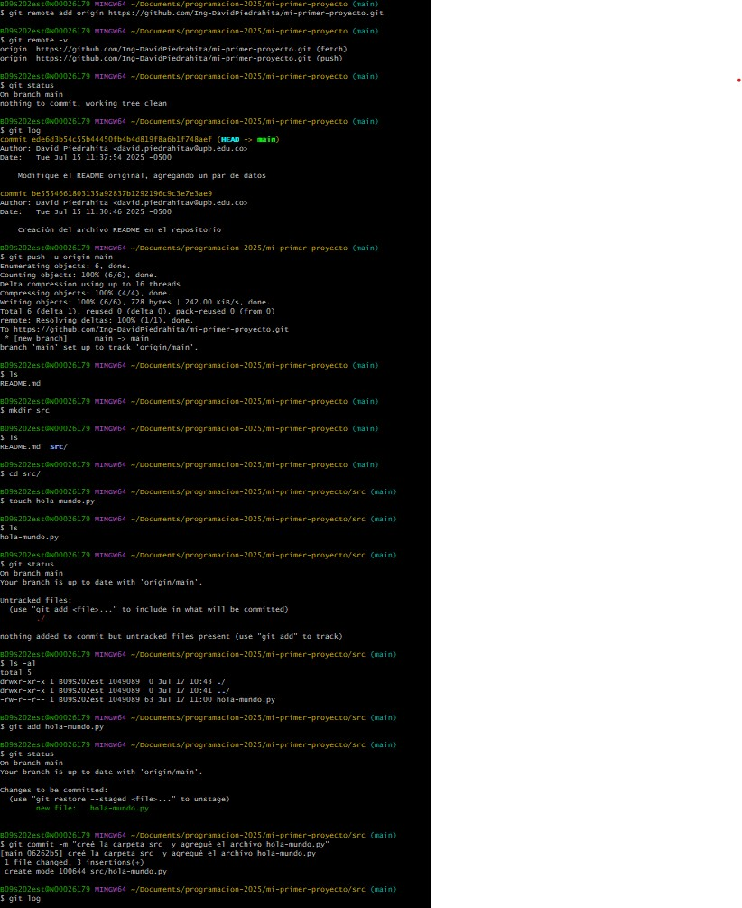

#Pasos  que seguir para crear un repositorio nuevo y enlazarlo con el local

1. **Creacion de cuenta en GitHub:** Lo primero que hicimos fue crear un cuenta dentro de GitHub en la página web.

2. **Crear un repositorio en Git Hub:** Creamos el repositorio, publico, le dimos nombre y agragamos una breve descripción.

3. **Cargamos el repositorio local al repositorio remoto:** Primero enlazamos nuestro repositorio local con el remoto usando 'git remote add origin' . Luego, haciendo uso del comando 'git push' mandamos la informacion de nuestro repositorio local al remoto.

